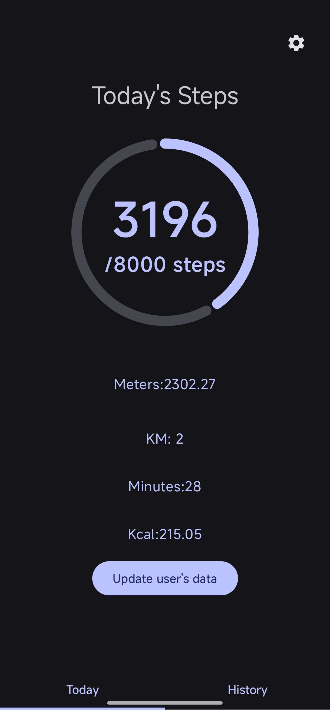
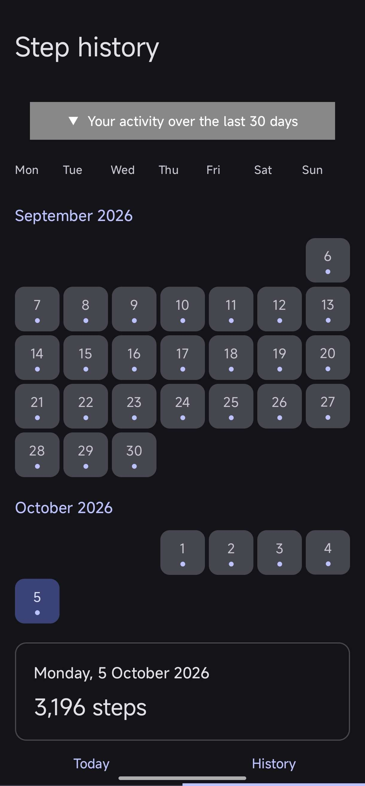
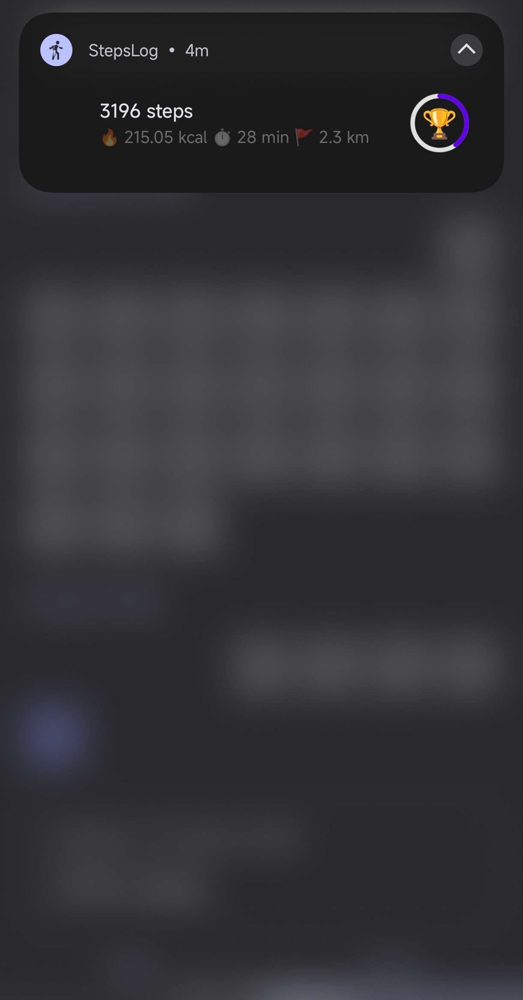

# StepLog 🚶

A modern, lightweight, and privacy-first Android step tracker. Built entirely with Kotlin and Jetpack Compose, StepLog runs efficiently in the background using hardware sensors and calculates active calorie burn based on dynamic cadence tracking. 

No ads, no gamification, and 100% offline data storage.

<p align="center">
  
  &nbsp;&nbsp;&nbsp;
  
  &nbsp;&nbsp;&nbsp;
  
</p>

## 🛠 Tech Stack & Architecture

This project is built using modern Android development practices and the Jetpack library suite:

*   **UI:** [Jetpack Compose](https://developer.android.com/jetpack/compose) for a fully declarative UI layer.
*   **Architecture:** **MVVM** (Model-View-ViewModel) with Clean Architecture principles (Repositories, UseCases).
*   **Concurrency:** [Kotlin Coroutines](https://kotlinlang.org/docs/coroutines-overview.html) and `Flow` / `StateFlow` for asynchronous, reactive data streams.
*   **Dependency Injection:** [Dagger Hilt](https://dagger.dev/hilt/).
*   **Local Storage:** 
    *   [Room Database](https://developer.android.com/training/data-storage/room) for persistent historical step data.
    *   [Preferences DataStore](https://developer.android.com/topic/libraries/architecture/datastore) for lightweight, synchronous user settings and daily totals.
*   **Background Processing:** Foreground Services configured for the modern `health` service type.

## ✨ Key Features

*   **Hardware Sensor Integration:** Utilizes `Sensor.TYPE_STEP_COUNTER` for highly accurate, low-battery step tracking.
*   **Dynamic Calorie Calculation:** Calculates Metabolic Equivalent of Task (MET) by analyzing walking cadence (steps per minute) and user measurements to estimate active calories burned.
*   **Data Portability:** Complete CSV export and import functionality, allowing users to backup or migrate their step history via the Android Storage Access Framework.
*   **Fully Localized:** Multi-language support out of the box (English, Greek, German, French, Spanish, Italian, Portuguese, Russian).

## 🧠 Technical Challenges Solved

**1. Efficient Background Tracking**
To prevent OS-level background restrictions from killing the tracker, the app utilizes a Foreground Service bound to a custom notification channel. To optimize battery life, database writes to Room and DataStore are batched and executed strictly on standard 30-second intervals rather than on every sensor event.

**2. State Preservation & Reboots**
Hardware step sensors reset on device reboot. The `StepsSensorListener` implements logic to detect sudden drops in hardware totals, gracefully resetting the baseline and ensuring no steps are lost or duplicated during power cycles.

**3. Reactive UI Lifecycle**
The UI layer safely observes data streams using `collectAsStateWithLifecycle()`, ensuring that database queries and Flow emissions pause when the app is minimized, preventing memory leaks and unnecessary CPU cycles.

## 🚀 Getting Started

### Prerequisites
*   Android Studio (Latest stable version)
*   A physical Android device (The emulator does not support hardware step sensors natively).

### Build Instructions
1. Clone the repository:
   ```bash
   git clone [https://github.com/yourusername/StepLog.git](https://github.com/yourusername/StepLog.git)
Open the project in Android Studio.

2. Sync Gradle and run the app on your physical device.

3. Grant the required "Physical Activity" and "Notifications" permissions upon launch.